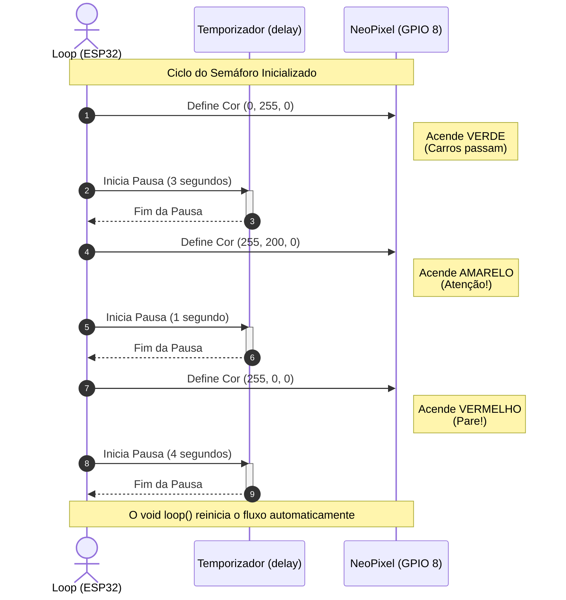
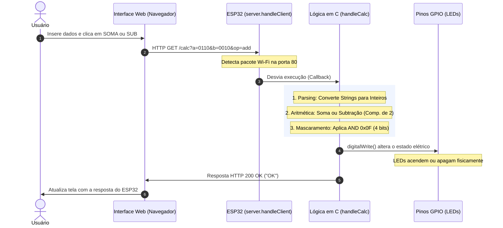
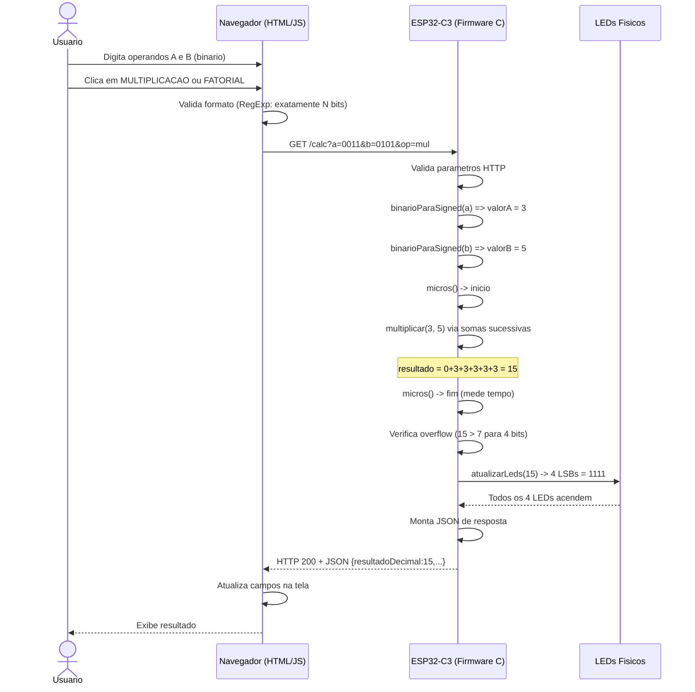
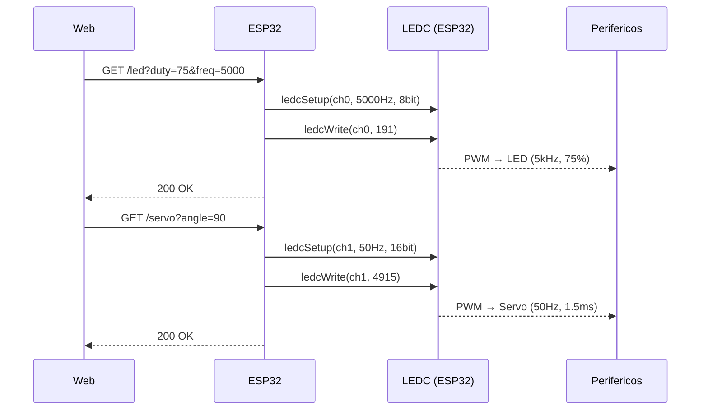
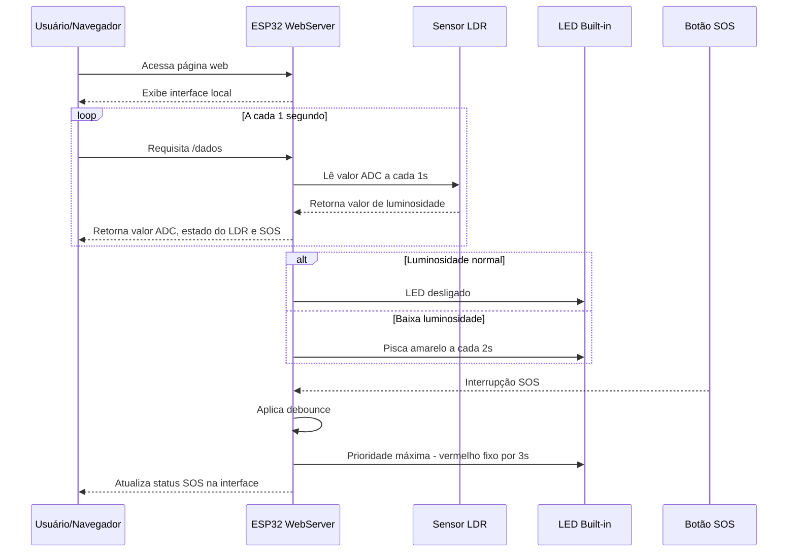
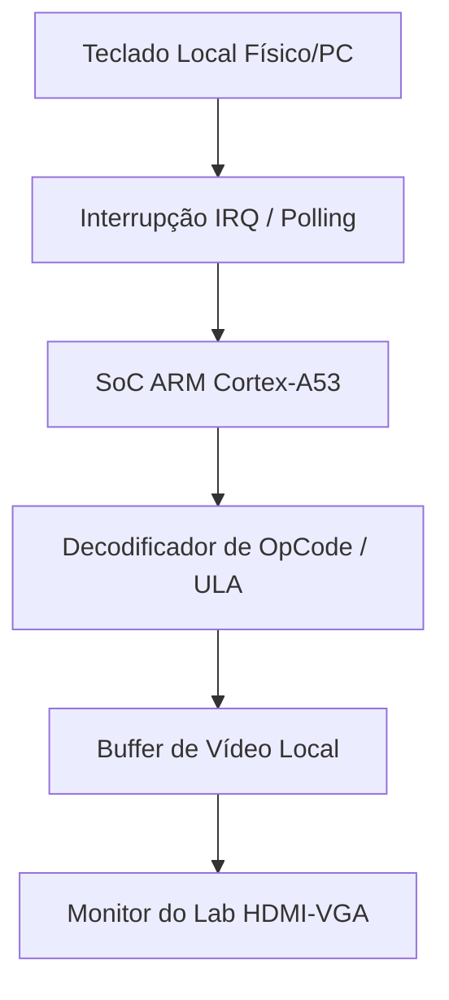
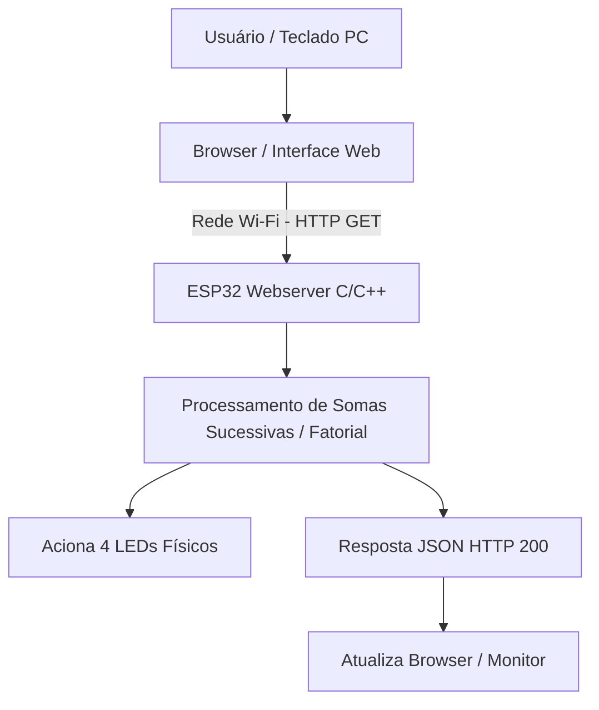

# PCS3732 — Laboratório de Sistemas Processadores (Lab Proc)

Este repositório contém as implementações desenvolvidas para as aulas práticas e desafios da disciplina **PCS3732 — Laboratório de Sistemas Processadores** (ou equivalentes de Laboratório de Processadores e Microcontroladores) da Escola Politécnica da Universidade de São Paulo (Poli-USP).

Os projetos cobrem desde a programação básica de microcontroladores utilizando o ecossistema ESP32 e C/C++, passando por sistemas embarcados web com arquitetura RISC-V, controle de atuadores com PWM, interrupções com debouncing em tempo real, até o desenvolvimento de sistemas complexos baseados em Raspberry Pi 3 (arquitetura ARM Cortex-A53) executando scripts em Python com displays LCD e teclados matriciais físicos.

---

## 🗺️ Mapa de Aulas e Projetos

| Aula / Projeto | Descrição | Componentes Principais | Linguagem / Plataforma |
| :--- | :--- | :--- | :--- |
| [**Aula 2: Semáforo Inteligente**](./aula2-semaforo) | Semáforo de três estágios com transições temporizadas. | LED NeoPixel (GPIO 8), ESP32-C3 | C++ (Arduino IDE) |
| [**Aula 3: Calculadora Binária**](./aula3-calculadora-binaria) | Calculadora de soma e subtração em complemento de 2 (4 bits) via rede sem fio. | ESP32 (Servidor Web), 4 LEDs (Saída Binária) | C++ (Backend) + HTML/JS (Frontend) |
| [**Aula 4: Calculadora Avançada**](./aula4-calculadora-multiplicacao-fatorial) | ULA avançada com Multiplicação (somas sucessivas), Fatorial e Divisão Inteira, medição de tempo de execução e detecção de overflow. | ESP32-C3, 4 LEDs (Saída Binária) | C++ (Backend) + HTML/JS (Frontend) |
| [**Aula 5: Controle de PWM**](./aula5-controle-de-hardware) | Controle de intensidade/frequência de LED e posicionamento angular de servo motor. | LED (PWM), Servo Motor (50Hz), ESP32 | C++ (Backend / LEDC) + Web UI |
| [**Aula 6: Monitoramento Inteligente**](./aula6-monitoramento-inteligente) | Sistema de monitoramento com sensor de luz LDR (ADC) e botão de pânico (SOS) via Interrupção de hardware e Debouncing. | Sensor LDR, Botão SOS, LED, ESP32 | C++ (Backend) + Web UI (Polling) |
| [**Aula 8: Calculadora Standalone RPi**](./aula8-calculadora-raspberrypi) | Calculadora independente executada diretamente em Raspberry Pi 3 com teclado de membrana e LCD 16x2. | Raspberry Pi 3 (ARM), Teclado Matricial, LCD I2C | Python |

---

## 🛠️ Detalhamento dos Projetos

### 🚥 Aula 2: Semáforo Inteligente
Implementação de um semáforo de tráfego básico controlado por uma máquina de estados finitos no loop do processador.
- **Hardware:** ESP32-C3 e LED NeoPixel.
- **Funcionamento:** Ciclo contínuo de três estados:
  - 🟢 **Verde:** 3 segundos.
  - 🟡 **Amarelo:** 1 segundo.
  - 🔴 **Vermelho:** 4 segundos.



---

### 🧮 Aula 3: Calculadora Binária Base
Calculadora remota que processa operações aritméticas simples de 4 bits em complemento de 2. A resposta é enviada de volta à interface Web e também representada fisicamente em LEDs.
- **Operações:** Soma (`add`) e Subtração (`sub`).
- **Protocolo:** Interface Web envia requisição HTTP GET para o servidor local no ESP32.
- **Lógica de Hardware:** Saída binária refletida nos pinos GPIO conectados a 4 LEDs.



---

### ⚡ Aula 4: Calculadora Aritmética Avançada
Aprimoramento da ULA (Unidade Lógica e Aritmética) com a adição de multiplicação via somas sucessivas e fatorial.
- **Destaques:**
  - Medição de tempo de processamento em microssegundos (`micros()`) enviada no JSON de resposta.
  - Tratamento e sinalização de *overflow* (excedendo limites de 4 bits: `-8` a `+7`).
  - **Desafio:** Implementação da divisão inteira no firmware.



---

### ⚙️ Aula 5: Controle de Hardware (PWM)
Utilização de modulação por largura de pulso (PWM) no ESP32 através do módulo **LEDC**.
- **Controle de LED:** Permite configurar a frequência da onda portadora e a razão cíclica (*duty cycle*), controlando a luminosidade de forma precisa.
- **Controle de Servo Motor:** Sinal de frequência fixa a 50 Hz com largura de pulso variando entre 1 ms e 2 ms para alterar o ângulo do servo motor entre 0° e 180°.



---

### 🛡️ Aula 6: Monitoramento Inteligente e Interrupções
Mecanismo de pooling e concorrência lógica com interrupção de hardware externa.
- **Monitoramento Analógico:** O ESP32 realiza leituras analógicas de luminosidade usando um sensor LDR. Se a luz estiver abaixo do limiar predefinido, um pisca-alerta amarelo (via LED NeoPixel) é acionado a cada 2 segundos.
- **Interrupção SOS:** O acionamento de um botão físico dispara uma rotina de serviço de interrupção (ISR) de alta prioridade. Com *software debouncing*, o sistema desativa alarmes de baixa prioridade e acende o LED em vermelho fixo por 3 segundos.



---

### 🖥️ Aula 8: Calculadora Standalone com Raspberry Pi 3
Nesta aula, a arquitetura distribuída (cliente-servidor) foi migrada para uma arquitetura monoprocessada executando em um processador **ARM Cortex-A53** da Raspberry Pi 3.
- **Hardware:** Teclado Matricial 4x4 e Display LCD 16x2 conectado por adaptador I2C (PCF8574).
- **Firmware/Software:** Script Python controlando varredura ativa de teclado matricial e comandos I2C para exibição no display.
- **Comparativo de Arquiteturas:**

```carousel
#### Arquitetura ARM (Monoprocessador Local)

<!-- slide -->
#### Arquitetura RISC-V (Rede/Distribuído)

```

---

## 🛠️ Configuração e Dependências

### 🔌 Projetos ESP32 / ESP32-C3
Para programar as placas da família ESP32:
1. Instale a **Arduino IDE** ou utilize a extensão do **PlatformIO** no VS Code.
2. Adicione o suporte às placas ESP32 nas configurações da IDE:
   - URL do Gerenciador de Placas: `https://raw.githubusercontent.com/espressif/arduino-esp32/gh-pages/package_esp32_index.json`
3. Instale as bibliotecas necessárias para os displays ou LEDs utilizados (ex: `Adafruit NeoPixel`).
4. Abra o respectivo arquivo `.ino` localizado no diretório de cada aula, configure as credenciais de rede Wi-Fi (se necessário) e efetue o upload.

### 🍓 Projetos Raspberry Pi (Python)
Para o projeto da Aula 8, acesse o terminal do Raspberry Pi e instale as dependências de hardware usando o Blinka da Adafruit:

```bash
pip install adafruit-circuitpython-register adafruit-blinka
```

Para rodar os scripts de teste ou a aplicação principal:
```bash
python3 aula8-calculadora-raspberrypi/desafio-aula8/desafio-aula8.py
```

---

## 📁 Estrutura do Diretório

```
PCS3732--Lab-Proc/
├── README.md
├── aula2-semaforo/
│   ├── aula2.cpp
│   └── aula2.md
├── aula3-calculadora-binaria/
│   ├── backend/
│   ├── desafio-aula/
│   │   └── desafio.ino
│   ├── experimento-aula/
│   │   └── calculadora_binaria.ino
│   └── documentation/
│       └── aula3.md
├── aula4-calculadora-multiplicacao-fatorial/
│   ├── desafio-aula/
│   │   └── calculadora_desafio_divisao_esp32_real.ino
│   ├── experimento-aula/
│   │   └── calculadora_multiplicacao_fatorial_esp32_real.ino
│   └── documentation/
│       └── aula4.md
├── aula5-controle-de-hardware/
│   ├── experimento-aula/
│   │   └── controle_pwm_led_servo_esp32.ino
│   └── documentation/
│       └── aula5.md
├── aula6-monitoramento-inteligente/
│   ├── desafio-aula6/
│   │   └── desafio-aula6.ino
│   ├── experimento-aula6/
│   │   └── monitoramento_ldr_esp32.ino
│   └── documentation/
│       └── aula6.md
└── aula8-calculadora-raspberrypi/
    ├── desafio-aula8/
    │   └── desafio-aula8.py
    ├── experimento-aula8/
    │   └── experimento-aula8.py
    ├── teste-teclado/
    │   ├── Keypad.py
    │   └── MatrixKeypad.py
    └── documentation/
        ├── arm-fluxogram.md
        └── riscV-fluxogram.md
```

---

*Repositório desenvolvido durante o curso prático na Escola Politécnica da USP.*