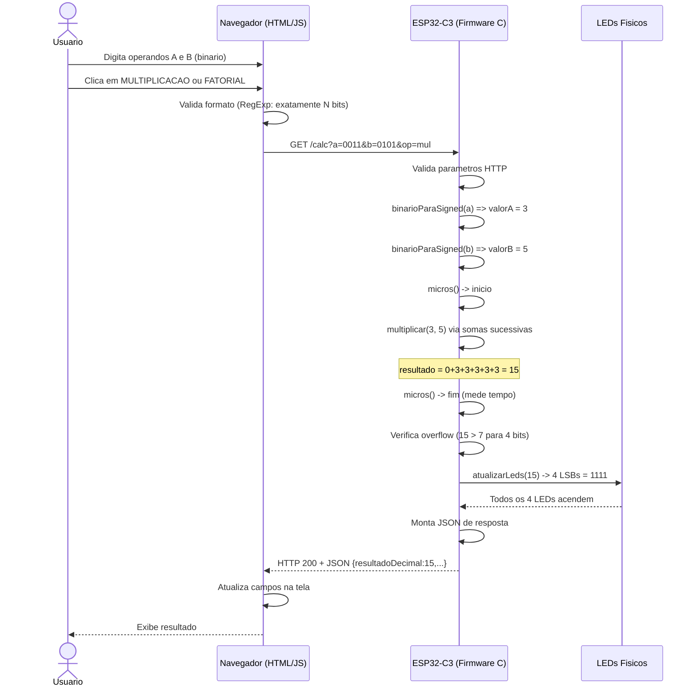

```mermaid
sequenceDiagram
    actor Usuario
    participant Browser as Navegador (HTML/JS)
    participant ESP32 as ESP32-C3 (Firmware C)
    participant LEDs as LEDs Fisicos


    Usuario->>Browser: Digita operandos A e B (binario)
    Usuario->>Browser: Clica em MULTIPLICACAO ou FATORIAL


    Browser->>Browser: Valida formato (RegExp: exatamente N bits)


    Browser->>ESP32: GET /calc?a=0011&b=0101&op=mul


    ESP32->>ESP32: Valida parametros HTTP
    ESP32->>ESP32: binarioParaSigned(a) => valorA = 3
    ESP32->>ESP32: binarioParaSigned(b) => valorB = 5
    ESP32->>ESP32: micros() -> inicio
    ESP32->>ESP32: multiplicar(3, 5) via somas sucessivas
    Note over ESP32: resultado = 0+3+3+3+3+3 = 15
    ESP32->>ESP32: micros() -> fim (mede tempo)
    ESP32->>ESP32: Verifica overflow (15 > 7 para 4 bits)
    ESP32->>LEDs: atualizarLeds(15) -> 4 LSBs = 1111
    LEDs-->>ESP32: Todos os 4 LEDs acendem
    ESP32->>ESP32: Monta JSON de resposta


    ESP32-->>Browser: HTTP 200 + JSON {resultadoDecimal:15,...}


    Browser->>Browser: Atualiza campos na tela
    Browser-->>Usuario: Exibe resultado
```