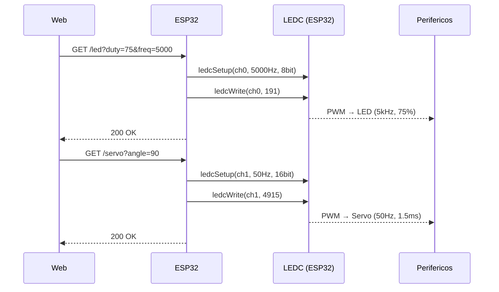

```mermaid
sequenceDiagram
    participant W as Web
    participant E as ESP32
    participant L as LEDC (ESP32)
    participant P as Perifericos

    W->>E: GET /led?duty=75&freq=5000
    E->>L: ledcSetup(ch0, 5000Hz, 8bit)
    E->>L: ledcWrite(ch0, 191)
    L-->>P: PWM → LED (5kHz, 75%)
    E-->>W: 200 OK

    W->>E: GET /servo?angle=90
    E->>L: ledcSetup(ch1, 50Hz, 16bit)
    E->>L: ledcWrite(ch1, 4915)
    L-->>P: PWM → Servo (50Hz, 1.5ms)
    E-->>W: 200 OK
```
