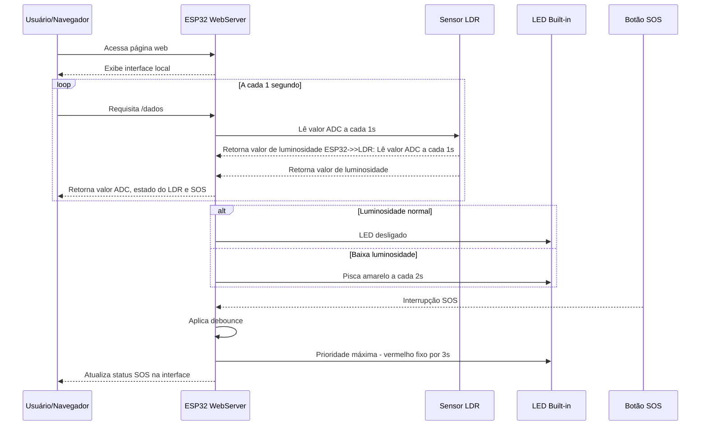

```mermaid
sequenceDiagram
    participant Usuario as Usuário/Navegador
    participant ESP32 as ESP32 WebServer
    participant LDR as Sensor LDR
    participant LED as LED Built-in
    participant Botao as Botão SOS


    Usuario->>ESP32: Acessa página web
    ESP32-->>Usuario: Exibe interface local

    loop A cada 1 segundo
        Usuario->>ESP32: Requisita /dados
            ESP32->>LDR: Lê valor ADC a cada 1s
    LDR-->>ESP32: Retorna valor de luminosidade    ESP32->>LDR: Lê valor ADC a cada 1s
    LDR-->>ESP32: Retorna valor de luminosidade
        ESP32-->>Usuario: Retorna valor ADC, estado do LDR e SOS
    end

    alt Luminosidade normal
        ESP32->>LED: LED desligado
    else Baixa luminosidade
        ESP32->>LED: Pisca amarelo a cada 2s
    end

    Botao-->>ESP32: Interrupção SOS
    ESP32->>ESP32: Aplica debounce
    ESP32->>LED: Prioridade máxima - vermelho fixo por 3s
    ESP32-->>Usuario: Atualiza status SOS na interface
```