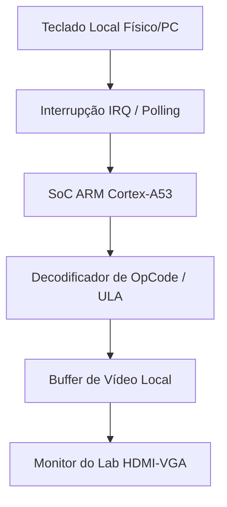

```mermaid
flowchart TD
    A[Teclado Local Físico/PC] --> B[Interrupção IRQ / Polling]
    B --> C[SoC ARM Cortex-A53]
    C --> D[Decodificador de OpCode / ULA]
    D --> E[Buffer de Vídeo Local]
    E --> F[Monitor do Lab HDMI-VGA]
```