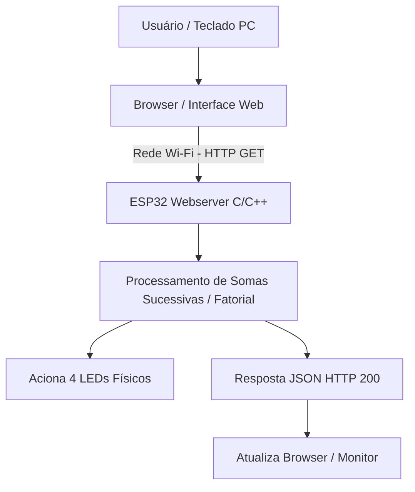

```mermaid
flowchart TD
    A[Usuário / Teclado PC] --> B[Browser / Interface Web]
    B -->|Rede Wi-Fi - HTTP GET| C[ESP32 Webserver C/C++]
    C --> D[Processamento de Somas Sucessivas / Fatorial]
    D --> E[Aciona 4 LEDs Físicos]
    D --> F[Resposta JSON HTTP 200]
    F --> G[Atualiza Browser / Monitor]
```