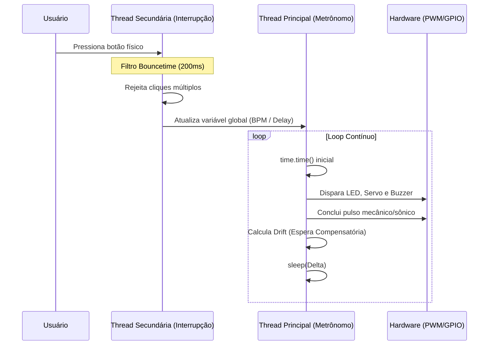

```mermaid
sequenceDiagram
participant U as Usuário
participant TS as Thread Secundária (Interrupção)
participant TP as Thread Principal (Metrônomo)
participant HW as Hardware (PWM/GPIO)
U->>TS: Pressiona botão físico
Note over TS: Filtro Bouncetime (200ms)
TS->>TS: Rejeita cliques múltiplos
TS->>TP: Atualiza variável global (BPM / Delay)
loop Loop Contínuo
TP->>TP: time.time() inicial
TP->>HW: Dispara LED, Servo e Buzzer
TP->>HW: Conclui pulso mecânico/sônico
TP->>TP: Calcula Drift (Espera Compensatória)
TP->>TP: sleep(Delta)
end

```