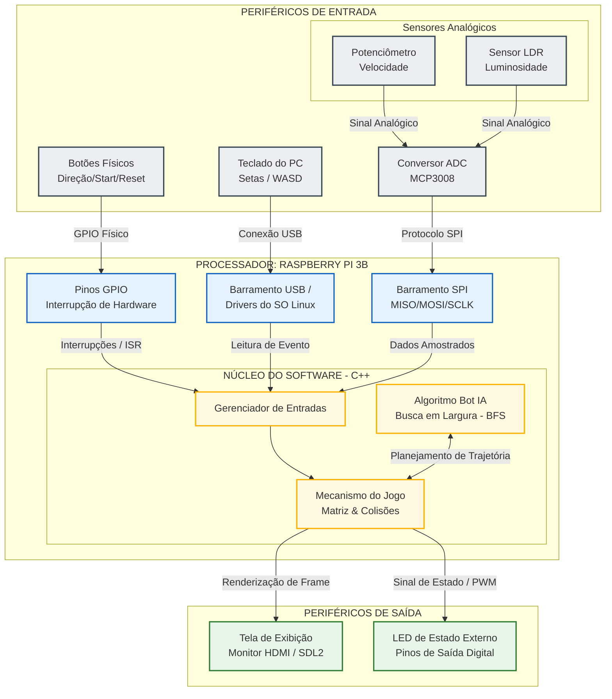

```mermaid
graph TB
    %% Estilos visuais industriais/técnicos
    classDef hardware fill:#ECEFF1,stroke:#37474F,stroke-width:2px;
    classDef rpi fill:#E3F2FD,stroke:#1565C0,stroke-width:2px;
    classDef logic fill:#FFF8E1,stroke:#FFB300,stroke-width:2px;
    classDef output fill:#E8F5E9,stroke:#2E7D32,stroke-width:2px;

    %% --- CAMADA DE ENTRADAS (HARDWARE EXTERNO) ---
    subgraph Camada_Entradas [PERIFÉRICOS DE ENTRADA]
        Btn[Botões Físicos<br>Direção/Start/Reset]:::hardware
        Teclado[Teclado do PC<br>Setas / WASD]:::hardware

        subgraph Sensores [Sensores Analógicos]
            Pot[Potenciômetro<br>Velocidade]:::hardware
            LDR[Sensor LDR<br>Luminosidade]:::hardware
        end

        ADC[Conversor ADC<br>MCP3008]:::hardware
    end

    %% --- CAMADA DE PROCESSAMENTO (RASPBERRY PI) ---
    subgraph RPi3B [PROCESSADOR: RASPBERRY PI 3B]
        GPIO[Pinos GPIO<br>Interrupção de Hardware]:::rpi
        SPI[Barramento SPI<br>MISO/MOSI/SCLK]:::rpi
        USB_Drivers[Barramento USB /<br>Drivers do SO Linux]:::rpi

        subgraph Core [NÚCLEO DO SOFTWARE - C++]
            M_Input[Gerenciador de Entradas]:::logic
            Engine[Mecanismo do Jogo<br>Matriz & Colisões]:::logic
            Bot[Algoritmo Bot IA<br>Busca em Largura - BFS]:::logic
        end
    end

    %% --- CAMADA DE SAÍDAS (RETORNO AO USUÁRIO) ---
    subgraph Camada_Saidas [PERIFÉRICOS DE SAÍDA]
        Tela[Tela de Exibição<br>Monitor HDMI / SDL2]:::output
        LED_RGB[LED de Estado Externo<br>Pinos de Saída Digital]:::output
    end

    %% --- CONEXÕES E BARRAMENTOS ---

    %% Conexões de Entrada para o Processador
    Btn -->|GPIO Físico| GPIO
    Teclado -->|Conexão USB| USB_Drivers

    Pot -->|Sinal Analógico| ADC
    LDR -->|Sinal Analógico| ADC
    ADC -->|Protocolo SPI| SPI

    %% Direcionamento dentro do Processador (Semicondutor -> Software)
    GPIO -->|Interrupções / ISR| M_Input
    USB_Drivers -->|Leitura de Evento| M_Input
    SPI -->|Dados Amostrados| M_Input

    M_Input --> Engine
    Bot <-->|Planejamento de Trajetória| Engine

    %% Conexões de Saída
    Engine -->|Renderização de Frame| Tela
    Engine -->|Sinal de Estado / PWM| LED_RGB
```
