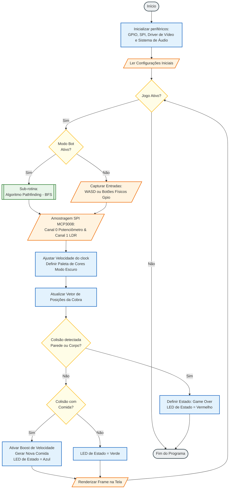

```mermaid
graph TD
    %% Estilos de nós e conexões técnicos (Paleta Minimalista de Engenharia)
    classDef startEnd fill:#ECEFF1,stroke:#37474F,stroke-width:2px,rx:15px,ry:15px;
    classDef process fill:#E3F2FD,stroke:#1565C0,stroke-width:2px;
    classDef subprocess fill:#E8F5E9,stroke:#2E7D32,stroke-width:2px,stroke-dasharray: 0;
    classDef io fill:#FFF3E0,stroke:#EF6C00,stroke-width:2px;
    classDef decision fill:#FFFDE7,stroke:#FBC02D,stroke-width:2px;

    %% DEFINIÇÃO DOS BLOCOS (ISO 5807)
    Start([Início]):::startEnd
    Init[Inicializar periféricos:<br>GPIO, SPI, Driver de Vídeo e Sistema de Áudio]:::process
    ReadConfig[/Ler Configurações Iniciais/]:::io

    %% Loop Principal
    LoopStart{Jogo Ativo?}:::decision

    %% Decisão de controle (Humano vs Bot)
    DecideControl{Modo Bot<br>Ativo?}:::decision

    %% Subprocessos específicos
    CalcBot[[Sub-rotina:<br>Algoritmo Pathfinding - BFS]]:::subprocess
    ReadInputs[/Capturar Entradas:<br>WASD ou Botões Físicos Gpio/]:::io

    %% Leituras ADC via SPI
    ReadSPI[/Amostragem SPI MCP3008:<br>Canal 0 Potenciômetro & Canal 1 LDR/]:::io
    ApplyAnalog[Ajustar Velocidade do clock<br>Definir Paleta de Cores Modo Escuro]:::process

    %% Lógica Física
    UpdateSnake[Atualizar Vetor de Posições da Cobra]:::process
    CheckCollision{Colisão detectada<br>Parede ou Corpo?}:::decision
    CheckFood{Colisão com<br>Comida?}:::decision

    %% Eventos de colisão
    TriggerGameOver[Definir Estado: Game Over<br>LED de Estado = Vermelho]:::process
    TriggerBoost[Ativar Boost de Velocidade<br>Gerar Nova Comida<br>LED de Estado = Azul]:::process
    NormalMove[LED de Estado = Verde]:::process

    %% Saída gráfica
    Render[/Renderizar Frame na Tela/]:::io

    End([Fim do Programa]):::startEnd

    %% CONEXÕES E FLUXO
    Start --> Init
    Init --> ReadConfig
    ReadConfig --> LoopStart

    LoopStart -- Sim --> DecideControl
    LoopStart -- Não --> End

    DecideControl -- Sim --> CalcBot
    DecideControl -- Não --> ReadInputs

    CalcBot --> ReadSPI
    ReadInputs --> ReadSPI

    ReadSPI --> ApplyAnalog
    ApplyAnalog --> UpdateSnake

    UpdateSnake --> CheckCollision

    CheckCollision -- Sim --> TriggerGameOver
    TriggerGameOver --> End

    CheckCollision -- Não --> CheckFood

    CheckFood -- Sim --> TriggerBoost
    CheckFood -- Não --> NormalMove

    TriggerBoost --> Render
    NormalMove --> Render

    Render --> LoopStart
```
