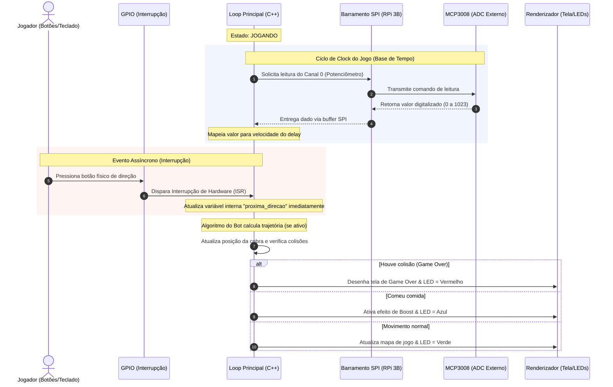

```mermaid
sequenceDiagram
    autonumber
    actor Jogador as Jogador (Botões/Teclado)
    participant GPIO as GPIO (Interrupção)
    participant Core as Loop Principal (C++)
    participant SPI as Barramento SPI (RPi 3B)
    participant ADC as MCP3008 (ADC Externo)
    participant Tela as Renderizador (Tela/LEDs)

    Note over Core: Estado: JOGANDO

    rect rgb(240, 245, 255)
        Note over Core, ADC: Ciclo de Clock do Jogo (Base de Tempo)
        Core->>SPI: Solicita leitura do Canal 0 (Potenciômetro)
        SPI->>ADC: Transmite comando de leitura
        ADC-->>SPI: Retorna valor digitalizado (0 a 1023)
        SPI-->>Core: Entrega dado via buffer SPI
        Note over Core: Mapeia valor para velocidade do delay
    end

    rect rgb(255, 245, 240)
        Note over Jogador, Core: Evento Assíncrono (Interrupção)
        Jogador->>GPIO: Pressiona botão físico de direção
        GPIO->>Core: Dispara Interrupção de Hardware (ISR)
        Note over Core: Atualiza variável interna "proxima_direcao" imediatamente
    end

    Note over Core: Algoritmo do Bot calcula trajetória (se ativo)
    Core->>Core: Atualiza posição da cobra e verifica colisões

    alt Houve colisão (Game Over)
        Core->>Tela: Desenha tela de Game Over & LED = Vermelho
    else Comeu comida
        Core->>Tela: Ativa efeito de Boost & LED = Azul
    else Movimento normal
        Core->>Tela: Atualiza mapa de jogo & LED = Verde
    end
```
